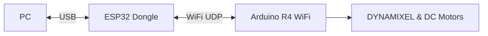

# Armlatable

アームテーブル制御システムのプロトタイプ集。

## ブランチ運用ルール

このリポジトリは以下のルールで運用されています。

- **`main`**: 動作確認が完了した安定版コードのみを配置します。通常の利用はこちらを使用してください。
- **`develop`**: 開発中のコードを配置します。機能追加や実験的な変更が含まれており、動作しない可能性があります。

---

## プロトタイプ一覧

| ディレクトリ | マイコン | 通信 | ステータス | 説明 |
|-------------|---------|------|-----------|------|
| [proto_r4_wifi](./proto_r4_wifi/) | Arduino R4 WiFi | **WiFi (Dongle)** | **🟢 最新** | ESP32ドングル制御 |
| [proto_pico](./proto_pico/) | Raspberry Pi Pico | USB Serial | 旧Ver | 初期プロトタイプ |

> [!TIP]
> **新規開発は [proto_r4_wifi](./proto_r4_wifi/) をベースにしてください。**

## システム構成 (proto_r4_wifi)



詳細は [proto_r4_wifi/docs/architecture.md](./proto_r4_wifi/docs/architecture.md) を参照。

## クイックスタート

プロトタイプのディレクトリに移動し、`make` コマンドを実行するだけで、書き込みから実行まで自動的に行われます。

```bash
# 最新版 (R4 WiFi)
cd proto_r4_wifi

# 初回のみ
make install
# ファームウェア書き込み -> 実行 (キーボードモード)
make
```

### その他のコマンド

| コマンド | 説明 |
|---------|------|
| `make` | ファームウェア書き込み + 実行 (`keyboard`) |
| `make flash` | ファームウェアの書き込みのみ |
| `make run` | 実行 (`keyboard`) のみ |
| `make test` | 自動テストモードを実行 |

## 共通コンポーネント

| コンポーネント | proto_r4_wifi | proto_pico |
|---------------|---------------|------------|
| PC 制御 | Python | Python |
| DYNAMIXEL | Shield (RS-485) | U2D2 (USB) |
| DC モーター | TB6612FNG | TB6612FNG |
| 通信 | **WiFi (Dedicated)** | USB Serial |
