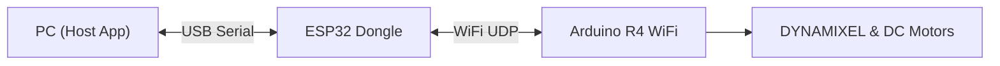

# Armlatable

アームテーブル制御システムのプロトタイプ集。

## ブランチ運用ルール

このリポジトリは以下のルールで運用されています。

- **`main`**: 動作確認が完了した安定版コードのみを配置します。通常の利用はこちらを使用してください。
- **`develop`**: 開発中のコードを配置します。機能追加や実験的な変更が含まれており、動作しない可能性があります。

---

# Armlatable (Locomo R4 WiFi)

Arduino R4 WiFi と ESP32 ドングルを使用したロボットアーム/台車制御システム。

## ブランチ運用ルール

- **`main`**: 動作確認が完了した安定版。
- **`develop`**: 開発版。

---

## システム構成



詳細は [docs/architecture.md](./docs/architecture.md) を参照。

## 必要なハードウェア

1. **PC 側**:
   - ESP32 開発ボード (M5Atom, DevKitC など) x1
   - USB ケーブル

2. **ロボット側**:
   - Arduino R4 WiFi
   - DYNAMIXEL Shield + XM430-W350
   - TB6612FNG + DC Motors
   - 12V 電源

## クイックスタート

### 1. 初回セットアップ

ホスト側のビルド環境とArduinoコアをセットアップします。

```bash
make setup
```

### 2. コンフィギュレーション (Optional)

`config.yaml` を編集してネットワーク設定やロボットパラメータを変更できます。ビルド時に自動的に反映されます。

### 3. ファームウェア書き込み

**Dongle (ESP32)** と **Robot (R4 WiFi)** の両方に書き込みが必要です。

```bash
# ドングルの書き込み (PCに接続して実行)
# ポートは Makefile の PORT_DONGLE を確認/編集
make flash-dongle

# ロボットの書き込み (PCに接続して実行)
# ポートは Makefile の PORT_ROBOT を確認/編集
make flash
```

### 4. 実行

PCアプリ（CLI）を起動して操作します。

```bash
make run-main
```

- **W/A/S/D**: 移動
- **X**: 停止
- **Q**: 終了

### その他のコマンド

| コマンド | 説明 |
|---------|------|
| `make setup` | 環境構築 (CMake, Arduino Core) |
| `make flash` | Robot (R4) への書き込み |
| `make flash-dongle` | Dongle (ESP32) への書き込み |
| `make flash-test` | 通信テスト用ファームウェアの書き込み (Lチカ確認用) |
| `make run-main` | CLIコントローラのビルドと実行 |
| `make run-viewer` | GUIビューワーのビルドと実行 |

---

## 旧プロトタイプについて

[outdated](./outdated/) ディレクトリに過去のプロトタイプ (proto_pico等) が格納されています。
