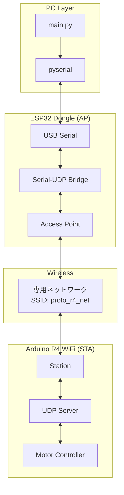
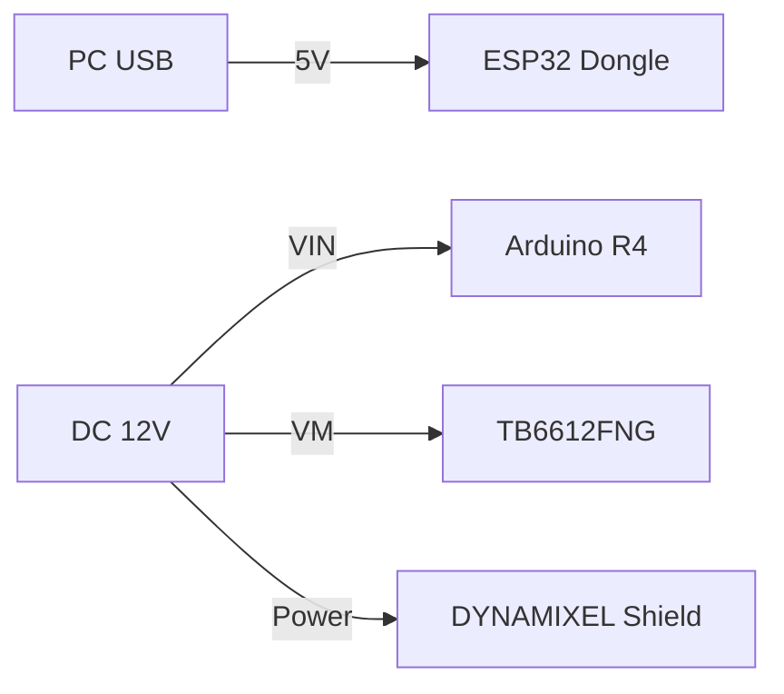

# システム構成

PC に接続した ESP32 ドングルと、ロボット上の Arduino R4 WiFi が専用の WiFi (UDP) ネットワークで通信する構成です。

## 概要

PC はドングルと USB シリアルで通信するため、PC 本体のネットワーク設定（インターネット接続など）に影響を与えません。ドングルが AP（親機）となり、Arduino R4 WiFi がそこに接続します。

- **通信路**: Serial (PC-Dongle) <-> WiFi UDP (Dongle-R4)
- **DYNAMIXEL**: XM430-W350 (RS-485)
- **DC モーター**: TB6612FNG

---

## システム構成図

```mermaid
graph LR
    subgraph PC_System["PC Side"]
        PC["Python App"] <-->|USB Serial| Dongle["ESP32 Dongle<br/>(AP Mode)"]
    end

    subgraph Robot_System["Robot Side"]
        R4["Arduino R4 WiFi<br/>(STA Mode)"] <--> Shield["DYNAMIXEL Shield<br/>(RS-485)"]
        Shield <--> DXL["XM430-W350<br/>(Max 3)"]
        R4 --> TB["TB6612FNG"]
        TB --> DC["DC Motor<br/>(Max 2)"]
    end

    Dongle <-->|WiFi UDP<br/>(Dedicated)| R4
```

---

## 詳細構成図



---

## 通信フロー

1. **PC -> Robot**:
   - Python: コマンド文字列 (`DC:100,100\n`) をシリアルポートに送信。
   - Dongle: シリアル受信した行をそのまま UDP パケットとして R4 にブロードキャスト (またはユニキャスト)。
   - R4: UDP パケットを受信し、コマンドを解析してモーターを制御。

2. **Robot -> PC**:
   - R4: ステータス文字列 (`S:100,100,...\n`) を生成し、UDP で Dongle に送信。
   - Dongle: UDP 受信したデータをそのままシリアルポートに出力。
   - Python: シリアルポートから行を読み取り、ステータスを更新。

---

## コンポーネント詳細

### 1. ESP32 ドングル
- **役割**: USB シリアルと WiFi UDP のブリッジ。
- **モード**: Access Point (AP)。独自の SSID を展開。
- **IP**: 192.168.4.1 (固定)

### 2. Arduino R4 WiFi
- **役割**: モーター制御。
- **モード**: Station (STA)。ドングルの SSID に接続。
- **通信**: DYNAMIXEL (RS-485), TB6612FNG (PWM)

---

## 配線・電源


